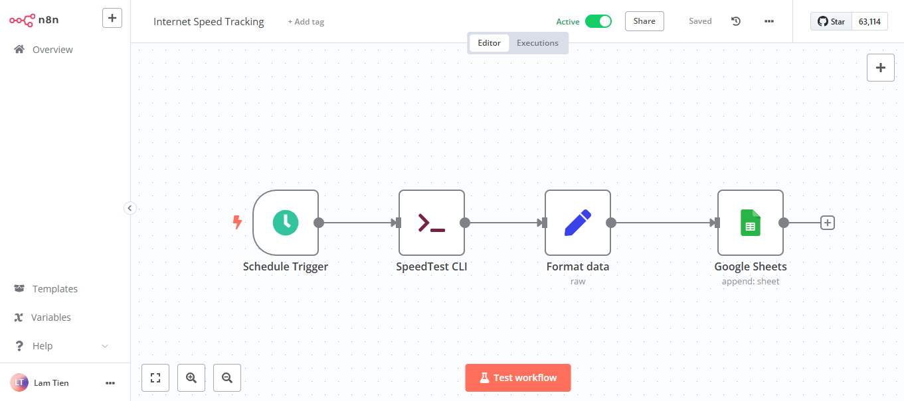

# Automated Internet Speed Tracking Application

This application uses n8n, speedtest-cli, and Google Sheets to automatically track and record your internet speed over time.

## Features

* Automated internet speed checks on a schedule (e.g., hourly, daily).
* Uses `speedtest-cli` to measure download, upload, and ping speeds.
* Stores results in Google Sheets for easy tracking and analysis.
* Uses n8n to automate the process.

## Requirements

* n8n installed and configured.
* `speedtest-cli` installed.
* Google account and Google Sheets.
* Google Sheets API access for n8n.

## Installation

1.  **Install `speedtest-cli`:**
    * On Linux/macOS: `pip install speedtest-cli`
    * On Windows: [Download and install from the official website](https://www.speedtest.net/apps/cli)
2.  **Install and configure n8n:**
    * Refer to the n8n installation guide on the official website: [https://docs.n8n.io/getting-started/installation/](https://docs.n8n.io/getting-started/installation/)
3.  **Configure Google Sheets API:**
    * Create a project on Google Cloud Console.
    * Enable the Google Sheets API.
    * Create a Service Account and download the JSON file containing credentials.
    * Share your Google Sheet with the created Service Account.
4.  **Import n8n workflow:**
    * Download the n8n workflow file from this repository [Internet Speed Tracking Workflow](Internet_Speed_Tracking.json).
    * Import the workflow file into n8n.
    * Configure the Google Sheets nodes with the downloaded credentials.
    * Configure the `Execute Command` node to run `speedtest-cli`.
    * Adjust the workflow execution schedule as needed.
5.  **Configure Google Sheet:**
    * Create a Google Sheet with corresponding columns (Timestamp, Download, Upload, Standardized Download, Standardized Upload, Ping, Note).
    * Ensure the sheet ID and sheet name match the configuration in the n8n workflow.

## Usage

* After installation and configuration, the n8n workflow will automatically run on the schedule and record results in Google Sheets.
* You can view and analyze the data in Google Sheets.

## Contributing

Contributions are welcome! Please create a pull request or issue to report bugs or suggest improvements.

## License

MIT License

## Notes

* Ensure your computer has an internet connection when the workflow runs.
* You can adjust the workflow execution schedule to suit your needs.
* For more accurate results, ensure that `speedtest-cli` is run on a computer that is directly connected to the modem(Not wifi if at all possible).
* Adding aditional information in regards to how to create the google api json file would be extremely usefull to new users.
